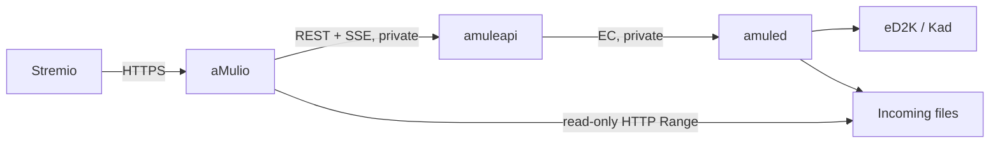

# aMulio — Stremio + aMule Streaming Addon

**Turn your self-hosted aMule library into a private Stremio source.**

aMulio is an open-source, self-hosted **Stremio addon for aMule**. It searches
the **eD2K and Kad networks** through `amuleapi`, lets you send selected movies
and TV episodes to aMule, and plays completed files back in Stremio over secure
HTTP streaming.

If you have searched for *“Stremio aMule addon”*, *“aMule streaming”*,
*“eD2K Stremio”* or *“Kad Stremio plugin”*, this is the missing bridge.

> **Private by design.** Your aMule EC port, `amuleapi`, download paths and
> credentials remain inside your home server or VPS. Stremio talks only to
> aMulio over HTTPS.

## Why aMulio?

aMule remains a capable headless client for the eD2K/Kad network, but it has
never had a modern Stremio integration. aMulio adds the media-server layer:

- Search aMule's eD2K/Kad network from a movie or episode page in Stremio.
- Rank video candidates by title, year, episode, quality, extension and source
  availability.
- Start an aMule download only when you select a stream.
- Play files already completed in aMule directly in Stremio, including HTTP
  seeking through Range requests.
- Keep the whole stack self-hosted: no debrid account, public indexer or cloud
  library is required.

## Stremio, Torrentio, Comet and aMule: what is different?

aMulio follows the familiar Stremio experience of addons such as
[Torrentio](https://github.com/TheBeastLT/torrentio-scraper) and
[Comet](https://github.com/g0ldyy/comet), but its backend is aMule rather than
BitTorrent or a debrid provider.

| Addon | Discovery and delivery model |
| --- | --- |
| **Torrentio** | Finds BitTorrent releases and returns torrent sources to Stremio. |
| **Comet** | Aggregates torrent sources and can use debrid caches or direct torrents. |
| **aMulio** | Searches eD2K/Kad through aMule, queues the selected eD2K file, then serves its completed local file to Stremio. |

This means that a cached Real-Debrid result from Comet or Torrentio can often
start immediately, while a new aMule result must first download. In aMulio,
already completed files are marked as ready and play immediately; new results
become ready when aMule reaches 100%.

aMulio is an independent project and is not affiliated with Torrentio, Comet,
Stremio, aMule, or any debrid service.

## How aMule streaming in Stremio works



1. Stremio requests streams for an IMDb movie or episode.
2. aMulio resolves its title through Cinemeta and searches aMule globally and
   through Kad.
3. It filters and ranks appropriate video files, then returns them as Stremio
   stream choices.
4. Selecting an unfinished result adds its `ed2k://` link to aMule.
5. Selecting a completed result securely streams the local file through
   aMulio, with `Range` support for seeking.

## Status

aMulio is under active development. The current vertical slice already
contains:

- Private configurable Stremio manifest.
- IMDb/Cinemeta title resolution for movies and series episodes.
- Parallel eD2K global and Kad searches through authenticated `amuleapi`.
- SQLite result caching and conservative filename/episode/quality ranking.
- Live download and shared-file state updates from `amuleapi` Server-Sent Events.
- Signed stream URLs that do not expose aMule credentials.
- Enqueueing selected eD2K links in aMule.
- Safe playback of completed files from approved Incoming roots.
- HTTP `Range`/seek support via Starlette's `FileResponse`.

### Next milestones

- A Stremio-friendly “download started / still downloading” status video.
- Better aliases, languages, release parsing and ranking rules.
- Docker image for a pinned aMule development build with `amuleapi` enabled.
- Experimental progressive playback for `.part` files, behind a feature flag.

Progressive playback is deliberately **not** part of v1. `amuleapi` currently
exposes per-part availability, but not a precise byte-range map or an API to
prioritise the range requested by a player. Completed-file streaming is the
reliable first milestone.

The step-by-step implementation roadmap and acceptance gates live in
[docs/DEVELOPMENT_PLAN.md](docs/DEVELOPMENT_PLAN.md).

The next MVP milestones prioritise a polished Torrentio/Comet-style
configuration experience, official aMule branding, English-first localisation,
an end-to-end **Download with aMule** flow and a novice-friendly Home Assistant
app. Progressive playback of incomplete `.part` files is intentionally
deferred until those product and distribution milestones are complete.

## Requirements

- A running `amuled` connected to eD2K/Kad.
- `amuleapi` from the pinned aMule development commit, built with
  `BUILD_AMULEAPI=ON`.
- A shared Incoming volume mounted read-only into aMulio at the same path used
  by aMule.
- A public HTTPS endpoint for remote Stremio clients, normally behind Caddy.
- Python 3.12+ for local development, or Docker for deployment.

`amuleapi` is the control plane only: it manages search and download state.
aMulio serves the completed file bytes itself, which is why its filesystem mount
is read-only and tightly restricted.

## Quick start for development

```sh
cp .env.example .env
# Edit .env: use long random values and point AMULE_API_BASE_URL at amuleapi.

uv sync --group dev
uv run uvicorn amulio.app:app --reload
```

Open `http://127.0.0.1:8000/configure` to obtain the private manifest URL for
Stremio.

The supplied `compose.yaml` builds the pinned `amuled` + `amuleapi` image
locally. Before starting it, create two files outside Git with high-entropy
passwords and point the matching variables in `.env` at them:

```sh
mkdir -p secrets
chmod 700 secrets
openssl rand -base64 32 > secrets/amule_ec_password
openssl rand -base64 32 > secrets/amuleapi_admin_password
chmod 600 secrets/*
docker compose up --build -d
```

Compose keeps aMule EC and amuleapi internal to the backend network. It uses
named volumes for config, Temp and Incoming; only aMulio gets the latter, at
`/data/incoming`, as read-only.

In production, Caddy is the only public HTTP service. It listens on ports 80
and 443, obtains and renews HTTPS certificates automatically, and proxies
requests to aMulio over the private Docker network. Set `CADDY_DOMAIN` to a DNS
name that already resolves to the host and use its `https://` URL as
`AMULIO_PUBLIC_URL`; aMulio, aMule EC and amuleapi do not expose public ports.
The separate `4662/TCP` and `4672/UDP` mappings are eD2K/Kad peer ports and
must remain reachable for good aMule connectivity.

### Metrics and logs

aMulio writes JSON request logs to standard output without installation or
playback tokens. The Prometheus-compatible `/metrics` endpoint is disabled by
default. To enable it for a private scraper, set `AMULIO_METRICS_TOKEN` and
send `Authorization: Bearer <token>`; keep that scraper on the private Docker
network or protect it separately at the proxy.

### Operations

The production backup, restore, upgrade, rollback and incident-response
procedures are in [the operations guide](docs/OPERATIONS.md). It preserves
configuration, the aMulio cache and Caddy certificate state, while deliberately
excluding aMule's transient Temp directory and Incoming media by default.

## Security and privacy

- Never expose the aMule EC port or `amuleapi` HTTP port to the Internet.
- Treat the installation URL as a bearer capability; do not share it publicly.
- Use a high-entropy `AMULIO_INSTALL_TOKEN` and `AMULIO_TOKEN_SECRET`.
- Mount only aMule's Incoming directory, read-only, into aMulio.
- Put aMulio behind HTTPS in production.
- Keep credentials in `.env` or Docker secrets, never in Git.

## FAQ

### Can Stremio use aMule?

Yes. aMulio is designed to make aMule search results and completed downloads
available inside Stremio without exposing aMule itself.

### Is aMulio a Torrentio replacement?

No. Torrentio is a BitTorrent addon. aMulio is for eD2K/Kad through aMule. They
can coexist in the same Stremio installation.

### Does aMulio need Real-Debrid?

No. It uses your own aMule instance and storage. This also means a fresh result
is not instantly playable until its aMule download completes.

### Can it stream incomplete aMule downloads?

Not in v1. That feature is planned as an opt-in experiment once the required
range-safety guarantees are in place.

## Development

```sh
uv run ruff check .
uv run pytest
docker compose --env-file .env.example config
```

Issues and pull requests are welcome. Please avoid adding credentials, eD2K
links, copyrighted media metadata, or private server details to the repository.
See [CONTRIBUTING.md](CONTRIBUTING.md) for the local checks and contribution
workflow, and [SECURITY.md](SECURITY.md) for responsible vulnerability reports.

## License

aMulio is released under the [Apache License 2.0](LICENSE).
